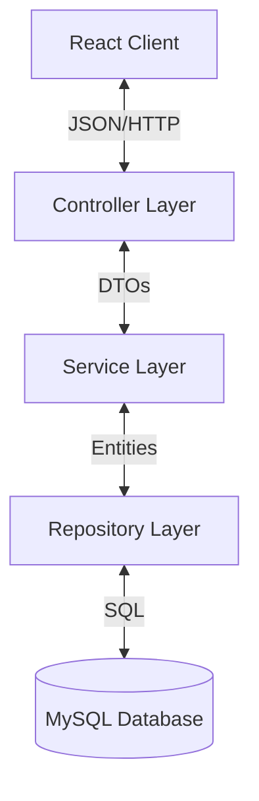

# 🚀 Task Management System - Enterprise Backend


> **Production-Ready, Secure, and Scalable REST API for Enterprise Task Management.**

---

## 🌟 Executive Summary

The **Task Management System Backend** is a robust, high-performance RESTful API designed to power modern web applications. Built with **Spring Boot 3** and **Java 17**, it implements industry-standard security patterns, comprehensive audit logging, and a layered architecture that ensures scalability and maintainability.

This backend serves as the foundation for the Task Management Frontend, providing secure endpoints for authentication, task lifecycle management, and user administration.

---

## ✨ Key Features (Interview Highlights)

### 🔐 Enterprise-Grade Security

- **Stateless Authentication**: Fully implemented **JWT (JSON Web Token)** based security architecture.
- **Role-Based Access Control (RBAC)**: Granular permissions for **ADMIN** and **USER** roles.
- **Password Encryption**: Industry-standard **BCrypt** hashing (10 rounds) for all user credentials.
- **CORS Configuration**: Securely configured for seamless integration with React/Vite frontends.

### 🛡️ Data Integrity & Auditing

- **Full Audit Trail**: Every record tracks `createdBy`, `createdOn`, `modifiedBy`, and `modifiedOn`.
- **Automatic Timestamping**: JPA `@PrePersist` and `@PreUpdate` hooks ensure temporal accuracy.
- **Defensive Programming**: Robust validation and safe default values (e.g., Status defaults to "Open", Priority to "MEDIUM").

### ⚡ High Performance & Scalability

- **Layered Architecture**: Clean separation of concerns (Controller → Service → Repository).
- **Pagination & Sorting**: Optimized data retrieval for large datasets (default sort by modification date).
- **Connection Pooling**: HikariCP implementation for efficient database resource management.

---

## 🛠️ Technology Stack

| Category           | Technology                  | Usage                                      |
| ------------------ | --------------------------- | ------------------------------------------ |
| **Core Framework** | Spring Boot 3.2.0           | Application context & dependency injection |
| **Language**       | Java 17                     | Core logic                                 |
| **Database**       | MySQL 8.0                   | persistent storage                         |
| **ORM**            | Spring Data JPA / Hibernate | Object-Relational Mapping                  |
| **Security**       | Spring Security + JWT       | Authentication & Authorization             |
| **Build Tool**     | Maven                       | Dependency management & building           |
| **Utilities**      | Lombok                      | Boilerplate reduction                      |

---

## 📂 Architecture Overview

The application follows a strict **Model-View-Controller (MVC)** design pattern adapted for REST APIs:



### Directory Structure

```
src/main/java/com/example/task_management_system/
├── controller/       # 🌐 REST Endpoints (AuthController, TaskController)
├── service/         # 🧠 Business Logic (TaskService, UserServices)
├── repository/      # 💾 Data Access (JPA Repositories)
├── model/          # 📦 JPA Entities (User, Task)
├── dto/            # 📨 Data Transfer Objects (Requests/Responses)
├── security/       # 🔐 JWT Filters & Config
└── exception/      # ⚠️ Global Exception Handling
```

---

## 🚀 Getting Started

### Prerequisites

- **Java 17+**
- **Maven 3.8+**
- **MySQL 8.0+**

### Installation & Setup

1. **Clone the Repository**

   ```bash
   git clone <repository-url>
   cd task-management-service
   ```

2. **Configure Database**
   Update `src/main/resources/application.properties`:

   ```properties
   spring.datasource.url=jdbc:mysql://localhost:3306/task_management_db
   spring.datasource.username=root
   spring.datasource.password=YourPassword
   app.jwtSecret=YourSecureSecretKey
   ```

3. **Run the Application**

   ```bash
   # Windows
   mvnw.cmd spring-boot:run

   # Linux/Mac
   ./mvnw spring-boot:run
   ```

   > The API will be available at `http://localhost:8080`.

---

## 🔌 API Documentation

### 👤 Authentication

| Method   | Endpoint             | Description              | Payload                                    |
| -------- | -------------------- | ------------------------ | ------------------------------------------ |
| **POST** | `/api/auth/register` | Register new user        | `{ "username": "...", "password": "..." }` |
| **POST** | `/api/auth/login`    | Authenticate & Get Token | `{ "username": "...", "password": "..." }` |

### 📋 Task Management

_All endpoints below require `Authorization: Bearer <token>` header._

| Method     | Endpoint          | Description               |
| ---------- | ----------------- | ------------------------- |
| **GET**    | `/api/tasks`      | Get all tasks (Paginated) |
| **POST**   | `/api/tasks`      | Create a new task         |
| **PUT**    | `/api/tasks/{id}` | Update task details       |
| **DELETE** | `/api/tasks/{id}` | Remove a task             |

#### Example: Create Task Payload

```json
{
  "title": "Database Migration",
  "description": "Migrate to PostgreSQL 15",
  "status": "Open",
  "priority": "HIGH",
  "dueDate": "2026-02-20T09:00:00"
}
```

---

## 🧪 Testing & Validation

You can test the API using **Postman** or **cURL**.

**1. Login & Get Token:**

```bash
curl -X POST http://localhost:8080/api/auth/login \
  -H "Content-Type: application/json" \
  -d '{"username":"admin","password":"admin123"}'
```

**2. Access Protected Route:**

```bash
curl -X GET http://localhost:8080/api/tasks \
  -H "Authorization: Bearer <YOUR_TOKEN_HERE>"
```

---

## 🚨 Troubleshooting

| Issue                   | Probable Cause    | Solution                                              |
| ----------------------- | ----------------- | ----------------------------------------------------- |
| **Connection Refused**  | MySQL not running | Start MySQL service on port 3306.                     |
| **401 Unauthorized**    | Invalid Token     | Check if JWT token is expired or malformed.           |
| **Table doesn't exist** | First run         | Ensure `spring.jpa.hibernate.ddl-auto=update` is set. |

---

## 👨‍💻 Author

**Mohamed Yasar A.**
_Full Stack Developer | Java & React Specialist_

---

_Last Updated: February 2026_
